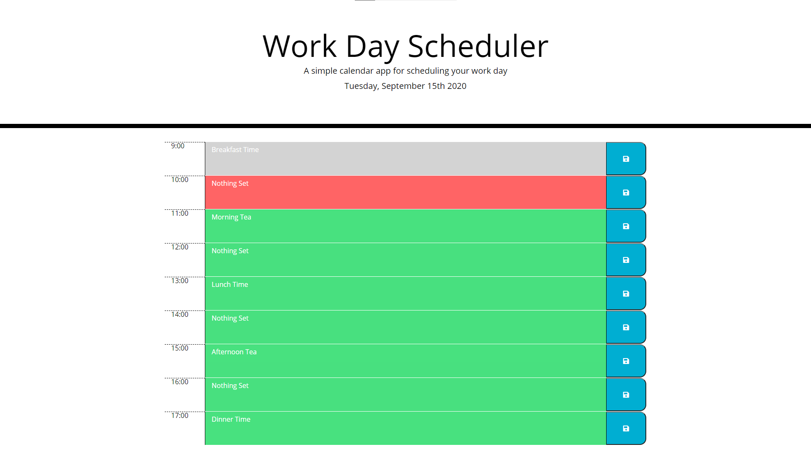

# Work Day Schedule WebApp
This website is for a task that involved creating a workday planner. It was to use Bootstrap for styling, and Moment.JS for time-related operations.
The page is designed to be responsive to screen size, and incorporates functionality to save and retrieve scheduled events from local storage.

# Preview Image

# Link
[Click this link](http://arbdt.github.io/work-day-scheduler) to access the deployed version of this web site.
